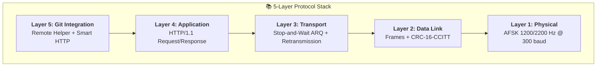
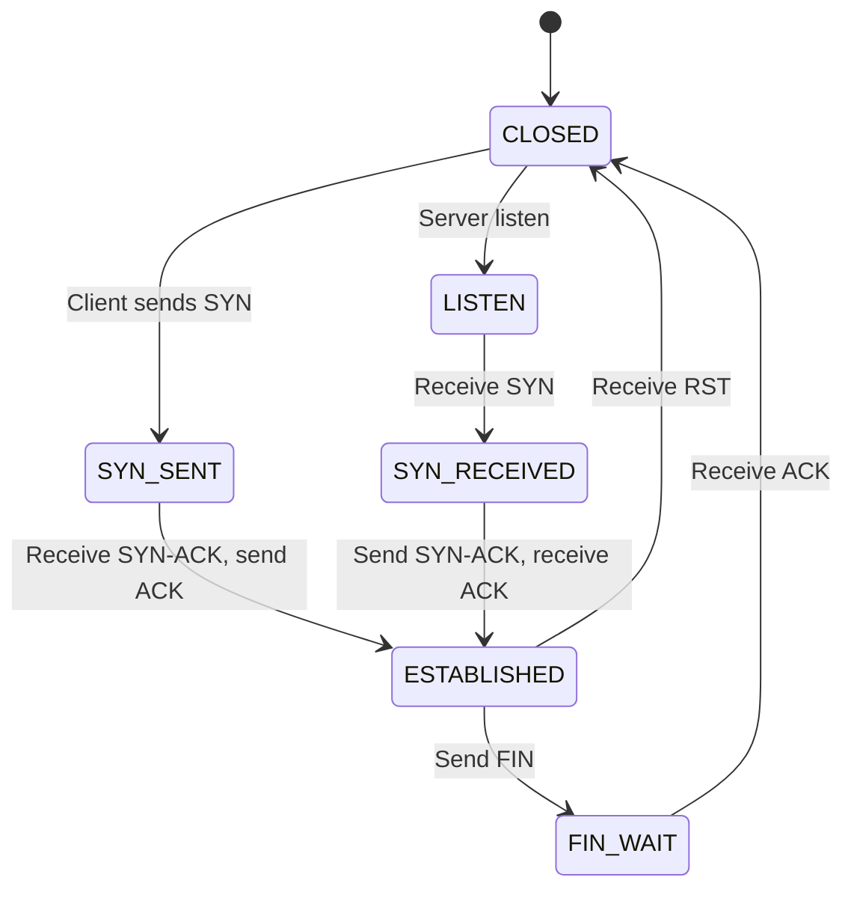

<h1 align="center">
  📡 Modumb
</h1>

<p align="center">
  <strong>Git over sound waves — clone repositories through your speaker and microphone</strong>
</p>

<p align="center">
  
  
  
  
</p>

<p align="center">
  <em>An acoustic modem implementation of Git transport using AFSK modulation</em>
</p>

```
   ┌─────────────┐                              ┌─────────────┐
   │  git clone  │    🔊 ~~~~~~~~~~~~ 🎤       │  git repo   │
   │   CLIENT    │      sound waves            │   SERVER    │
   └─────────────┘                              └─────────────┘
         │                                            │
    ♪ 1200 Hz = 1    ════════════════════════   ♪ 1200 Hz = 1
    ♪ 2200 Hz = 0    ════════════════════════   ♪ 2200 Hz = 0
```

---

## 🎬 How It Works

```mermaid
flowchart LR
    subgraph Client["🖥️ Client Machine"]
        GC[git clone] --> RH[Remote Helper]
        RH --> HC[HTTP Client]
        HC --> RT1[Reliable Transport]
        RT1 --> F1[Framer]
        F1 --> M1[AFSK Modem]
        M1 --> S1["🔊 Speaker"]
    end

    S1 -.->|"♪ Sound Waves ♪"| M2

    subgraph Server["🖥️ Server Machine"]
        M2["🎤 Microphone"] --> M3[AFSK Modem]
        M3 --> F2[Framer]
        F2 --> RT2[Reliable Transport]
        RT2 --> HS[HTTP Server]
        HS --> GS[git-upload-pack]
    end
```



The modem converts Git data into audio tones at **1200 Hz** (mark/1) and **2200 Hz** (space/0), transmits through speakers, receives via microphone, and reconstructs the data on the other side.

---

## ✅ Current Status

This is a **working proof-of-concept** that successfully clones Git repositories over audio!

### Working Features

- [x] **AFSK modulation/demodulation** (Bell 202-style, 1200/2200 Hz)
- [x] **Reliable transport** with Stop-and-Wait ARQ and CRC-16 error detection
- [x] **3-way handshake** session establishment (SYN → SYN-ACK → ACK)
- [x] **Git Smart HTTP** protocol implementation
- [x] **Cross-platform audio** (Windows, macOS, Linux, WSL2)
- [x] **Loopback mode** for testing without audio hardware
- [x] **`git clone`** over acoustic modem

### Performance

| Metric | Value |
|--------|-------|
| Baud Rate | 300 baud |
| Throughput | ~37.5 bytes/sec |
| 1KB clone | ~30 seconds |
| 10KB clone | ~5 minutes |

### Demo Output

```
$ MODEM_LOOPBACK=1 git clone modem://audio/repo test-clone
Cloning into 'test-clone'...
[MODEM] Sending: 64 bytes (SYN)
[MODEM] Received: 64 bytes (SYN-ACK)
[MODEM] Session established
[MODEM] GET /info/refs?service=git-upload-pack
[MODEM] Receiving pack data...
Receiving objects: 100% (3/3), done.
```

📖 **See [DEBUGGING_JOURNEY.md](DEBUGGING_JOURNEY.md) for the full technical chronicle**

---

## 🚀 Quick Start

### 30-Second Installation

```bash
git clone https://github.com/your-username/modumb.git
cd modumb
python3 -m venv .venv && source .venv/bin/activate
pip install -e .
export PATH="$PWD/bin:$PATH"
```

### Test with Loopback (No Audio Hardware)

**Terminal 1 — Server:**
```bash
modem-git-server --loopback /path/to/your/repo
```

**Terminal 2 — Client:**
```bash
MODEM_LOOPBACK=1 git clone modem://audio/repo local-copy
```

### End-to-End Test Script

Run the automated test that creates a repo, starts the server, and clones via acoustic modem:

```bash
./scripts/run-loopback-test.sh
```

Or test just the modem layer:

```bash
./scripts/test-audio-loopback.sh          # Silent loopback
./scripts/test-audio-loopback.sh --audible # Hear the modem sounds!
```

---

## 🏗️ Architecture

### Protocol Stack



### Frame Format

```
┌──────────────────────────────────────────────────────────────────────┐
│                           FRAME STRUCTURE                            │
├───────────┬──────┬──────┬─────┬─────┬───────────────────┬───────────┤
│ PREAMBLE  │ SYNC │ TYPE │ SEQ │ LEN │      PAYLOAD      │   CRC-16  │
│  16 × AA  │ 7E7E │  1B  │ 2B  │ 2B  │     0-64 bytes    │   2 bytes │
├───────────┴──────┴──────┴─────┴─────┴───────────────────┴───────────┤
│   16 bytes    2B     1B    2B    2B       variable          2B      │
└──────────────────────────────────────────────────────────────────────┘

Frame Types: DATA(0x01) | ACK(0x02) | NAK(0x03) | SYN(0x04) | SYN-ACK(0x05) | FIN(0x06) | RST(0x07)
```

### Connection State Machine



---

## 📦 Installation

### Prerequisites

- Python 3.10+
- Working speaker and microphone (or use loopback mode)
- Platform-specific audio libraries (see below)

### Install from Source

```bash
# Clone the repository
git clone https://github.com/your-username/modumb.git
cd modumb

# Create virtual environment
python3 -m venv .venv
source .venv/bin/activate  # Linux/macOS
# .venv\Scripts\activate   # Windows

# Install in editable mode
pip install -e .

# Add to PATH (for git to find the remote helper)
export PATH="$PWD/bin:$PATH"
# Or add to ~/.bashrc: export PATH="/path/to/modumb/bin:$PATH"
```

### Platform-Specific Setup

<details>
<summary><b>🐧 Linux (Native)</b></summary>

```bash
# Ubuntu/Debian
sudo apt install libportaudio2 portaudio19-dev

# Fedora
sudo dnf install portaudio portaudio-devel

# Arch
sudo pacman -S portaudio

pip install --force-reinstall sounddevice
```
</details>

<details>
<summary><b>🍎 macOS</b></summary>

```bash
brew install portaudio
pip install --force-reinstall sounddevice
```

Grant microphone permission: **System Preferences → Security & Privacy → Microphone**
</details>

<details>
<summary><b>🪟 Windows</b></summary>

Works out of the box. If issues occur:
```cmd
pip install --force-reinstall sounddevice
```
</details>

<details>
<summary><b>🐧 WSL2 (Windows Subsystem for Linux)</b></summary>

WSL2 doesn't have native audio. Choose one option:

**Option 1: WSLg (Windows 11 - Recommended)**
```bash
sudo apt install libportaudio2
modem-audio devices  # Should show PulseAudio devices
```

**Option 2: PulseAudio Virtual Loopback**

Create a virtual speaker/microphone pair for testing:
```bash
# Create null sink (virtual speaker → virtual mic)
pactl load-module module-null-sink \
    sink_name=ModemLoopback \
    sink_properties=device.description=ModemLoopback \
    rate=48000 channels=1

# Set as default
pactl set-default-sink ModemLoopback
pactl set-default-source ModemLoopback.monitor
```

**Option 3: Loopback Mode (Testing Only)**
```bash
MODEM_LOOPBACK=1 git clone modem://audio/repo local-copy
```

📖 **See [docs/WSL2_SETUP.md](docs/WSL2_SETUP.md) for comprehensive WSL2 setup instructions**
</details>

### Verify Installation

```bash
# Check audio devices
modem-audio devices

# Test audio I/O
modem-audio test

# Run unit tests
pytest tests/ -v
```

---

## 💻 Usage

### Audio Device Management

```bash
# List all audio devices
modem-audio devices

# Test default devices
modem-audio test

# Test specific devices (by index)
modem-audio test -i 3 -o 5
```

### Server Mode

Run on the machine with the Git repository:

```bash
# Basic server
modem-git-server /path/to/repo

# With specific audio devices
modem-git-server -i 3 -o 5 /path/to/repo

# Loopback mode (no audio hardware)
modem-git-server --loopback /path/to/repo

# Audible loopback (hear the modem sounds!)
modem-git-server --loopback --audible /path/to/repo
```

### Client Mode (git clone)

```bash
# Clone with default audio devices
git clone modem://audio/repo local-copy

# Clone with specific devices
MODEM_INPUT_DEVICE=3 MODEM_OUTPUT_DEVICE=5 git clone modem://audio/repo local-copy

# Loopback mode
MODEM_LOOPBACK=1 git clone modem://audio/repo local-copy

# Audible loopback
MODEM_LOOPBACK=1 MODEM_AUDIBLE=1 git clone modem://audio/repo local-copy
```

### Environment Variables

| Variable | Description | Default |
|----------|-------------|---------|
| `MODEM_INPUT_DEVICE` | Microphone device index | System default |
| `MODEM_OUTPUT_DEVICE` | Speaker device index | System default |
| `MODEM_LOOPBACK` | Enable loopback mode (`1`, `true`, `yes`) | Disabled |
| `MODEM_AUDIBLE` | Play audio in loopback mode | Disabled |
| `PULSE_SERVER` | PulseAudio server (for WSL2) | — |

---

## 🔧 Technical Specifications

### AFSK Modem Parameters

| Parameter | Value | Notes |
|-----------|-------|-------|
| Modulation | AFSK | Audio Frequency Shift Keying |
| Mark frequency (1) | 1200 Hz | Binary 1 |
| Space frequency (0) | 2200 Hz | Binary 0 |
| Baud rate | 300 baud | ~37.5 bytes/sec |
| Sample rate | 48000 Hz | Standard audio rate |
| Samples per bit | 160 | 48000 / 300 |
| Filter bandwidth | 400 Hz | Tuned for clock drift tolerance |

### Frame Protocol

| Field | Size | Description |
|-------|------|-------------|
| Preamble | 16 bytes | 0xAA × 16 for bit sync |
| Sync | 2 bytes | 0x7E 0x7E frame delimiter |
| Type | 1 byte | Frame type (DATA, ACK, etc.) |
| Sequence | 2 bytes | 16-bit sequence number |
| Length | 2 bytes | Payload length |
| Payload | 0-64 bytes | Application data |
| CRC | 2 bytes | CRC-16-CCITT |

### Timing Parameters

| Parameter | Value | Purpose |
|-----------|-------|---------|
| ARQ timeout | 5.0 sec | Wait for ACK |
| ARQ retries | 5 | Max retransmission attempts |
| Echo guard | 80 ms | Half-duplex echo suppression |
| Turnaround delay | 50 ms | TX→RX switching |
| Silence detection | 300 ms | Frame boundary detection |
| Max payload | 64 bytes | Limit clock drift accumulation |

---

## 🗺️ Roadmap

### Near-Term Goals

- [ ] **Push support** — `git push` over acoustic modem
- [ ] **Protocol v2** — Git protocol version 2 for efficiency
- [ ] **Forward Error Correction (FEC)** — Reduce retransmissions

### Future Possibilities

- [ ] **Higher baud rates** — 1200 baud, 2400 baud
- [ ] **Real-world testing** — Air-gap transmission between physical devices
- [ ] **Web Audio API** — Browser-based implementation
- [ ] **Multiple channels** — Frequency-division multiplexing

---

## ⚠️ Known Issues

See [ISSUES.md](ISSUES.md) for detailed information.

### ALSA Underrun Errors

```
ALSA lib pcm.c:8740:(snd_pcm_recover) underrun occurred
```

**Impact:** Low — ARQ retransmission handles corrupted frames automatically.

**Status:** Working around via CRC verification and automatic retransmission.

---

## 🧪 Contributing

### Running Tests

```bash
source .venv/bin/activate

# Unit tests
pytest tests/ -v
pytest tests/ -v --cov=modumb  # With coverage

# End-to-end test (loopback mode)
./scripts/run-loopback-test.sh

# Modem layer test
./scripts/test-audio-loopback.sh
```

### Test Scripts

| Script | Description |
|--------|-------------|
| `scripts/setup-test-repo.sh` | Create a minimal test repository |
| `scripts/run-loopback-test.sh` | Full end-to-end git clone test |
| `scripts/test-audio-loopback.sh` | Test AFSK modem layer only |

### Project Structure

```
modumb/
├── bin/                          # Entry point scripts
│   ├── git-remote-modem          # Git remote helper
│   ├── modem-git-server          # Server entry point
│   └── modem-audio               # Audio device CLI
├── scripts/                      # Test and setup scripts
│   ├── setup-test-repo.sh        # Create test repository
│   ├── run-loopback-test.sh      # End-to-end loopback test
│   └── test-audio-loopback.sh    # AFSK modem layer test
├── docs/                         # Additional documentation
│   └── WSL2_SETUP.md             # WSL2 audio setup guide
├── src/modumb/
│   ├── modem/                    # Layer 1: Physical (AFSK)
│   │   ├── afsk.py               # AFSK modulation/demodulation
│   │   ├── modem.py              # High-level modem interface
│   │   └── audio_io.py           # Cross-platform audio I/O
│   ├── datalink/                 # Layer 2: Framing + CRC
│   │   ├── frame.py              # Frame encoding/decoding
│   │   └── framer.py             # Frame transmission
│   ├── transport/                # Layer 3: Reliable delivery
│   │   ├── reliable.py           # Stop-and-Wait ARQ
│   │   └── session.py            # 3-way handshake sessions
│   ├── http/                     # Layer 4: HTTP protocol
│   │   ├── client.py             # HTTP/1.1 client
│   │   ├── server.py             # HTTP/1.1 server
│   │   └── pktline.py            # Git pkt-line format
│   ├── git/                      # Layer 5: Git integration
│   │   ├── remote_helper.py      # git-remote-modem
│   │   └── smart_http.py         # Git Smart HTTP
│   └── cli.py                    # Audio device management
└── tests/                        # Test suite
    ├── test_afsk.py
    ├── test_frame.py
    └── test_pktline.py
```

---

## 🔊 Physical Setup for Real Audio

### Option 1: Audio Loopback Cable

Connect line-out to line-in with a 3.5mm audio cable.

### Option 2: Two Computers

1. Place computers 1-2 meters apart in a **quiet room**
2. Point speakers toward microphones
3. Set volume to ~50% (avoid distortion)
4. Disable system sounds and notifications

### Troubleshooting

```bash
# List audio devices
python3 -c "import sounddevice; print(sounddevice.query_devices())"

# Test audio output (should hear 1kHz tone)
python3 -c "
import sounddevice as sd
import numpy as np
t = np.linspace(0, 1, 48000)
sd.play(0.5 * np.sin(2*np.pi*1000*t), 48000)
sd.wait()
"
```

---

## 📜 License

MIT License — see [LICENSE](LICENSE) for details.

---

## 🙏 Acknowledgments

- Inspired by acoustic modems of the dial-up era
- Bell 202 AFSK modulation specification
- Git Smart HTTP protocol documentation

---

<p align="center">
  <sub>Built with 🔊 and curiosity</sub>
</p>
